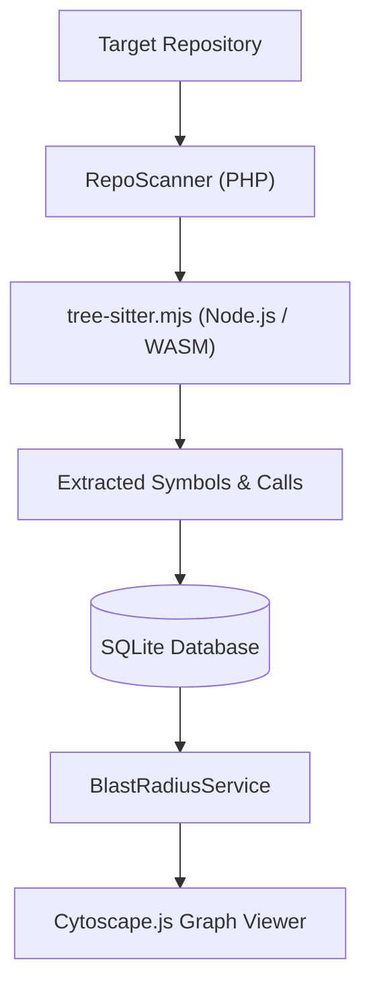

# 🎓 WTFCode — Beginner's Learning Guide

## What This Project Does
**WTFCode** is a local-first codebase archaeologist and developer intelligence tool. When a developer inherits a large, unfamiliar project, WTFCode statically scans all source files, extracts Abstract Syntax Tree (AST) symbols (functions, classes, routes, models), maps dependencies, calculates "blast radius" (what could break if you edit a file), and provides evidence-backed explanations.

---

## Technologies Used
- **Backend Core**: PHP 8.4 (modern strict types, custom MVC microframework).
- **AST & Parsing Workers**: Node.js, Web-Tree-Sitter (WebAssembly grammars for JS, TS, Python, PHP), ast-grep, ts-morph.
- **Frontend & Visualizations**: Cytoscape.js (interactive graph visualization), Vanilla JavaScript, Semantic HTML, CSS.
- **Database**: SQLite (default zero-config database) / PostgreSQL (production).
- **Testing**: PHPUnit, custom benchmark and structural test runners.

---

## Project Structure
```
WTFCode/
├── bootstrap.php       # Global autoloader, exception handling, sessions & security headers
├── public/             # Web server document root
│   ├── index.php       # Landing page
│   ├── dashboard.php   # Repository projects overview
│   ├── project.php     # Main project graph & evidence explorer
│   ├── change.php      # Git change-guard & blast radius review
│   └── map.php         # Interactive dependency graph
├── src/                # Core business logic & services
│   ├── Auth.php        # User authentication & password hashing
│   ├── Database.php    # PDO connection manager & SQL helpers
│   ├── RepoScanner.php # Static analysis orchestrator
│   ├── FeatureTracer.php # Feature evidence tracer
│   ├── BlastRadiusService.php # Calculates transitive impacts of code edits
│   ├── ExplanationService.php # Generates deterministic code explanations
│   └── SymbolRepository.php # SQL repository for indexed code symbols
├── workers/            # Background AST parsing workers
│   ├── tree-sitter.mjs # Tree-Sitter AST worker (WASM)
│   ├── ast-grep.mjs    # Structural pattern matching worker
│   └── typescript-semantic.mjs # TypeScript compiler API worker
├── views/              # Reusable PHP UI partials (header, footer, navigation)
└── tests/              # Comprehensive test suite & benchmark fixtures
```

---

## How the Application Starts
1. The web server (e.g. PHP built-in server or Caddy) points to `public/index.php`.
2. `bootstrap.php` initializes Composer autoloader, checks database connectivity, and starts secure session handling.
3. When a user imports a repository:
   - `RepoScanner.php` discovers project files.
   - It invokes the background worker `workers/tree-sitter.mjs` via standard I/O (STDIN/STDOUT).
   - AST nodes and call relationships are stored in the database.
   - The user can explore the repository graph visually via Cytoscape.js.

---

## Application Flow


---

## Important Files
- `bootstrap.php`: The foundational runtime bootstrapper.
- `src/RepoScanner.php`: The static analysis coordinator.
- `src/BlastRadiusService.php`: Algorithms for computing dependency impact.
- `workers/tree-sitter.mjs`: AST parsing engine using WebAssembly.
- `public/project.php`: Primary repository analysis dashboard.

---

## Important Concepts
- **Abstract Syntax Tree (AST)**: A tree representation of the syntactic structure of source code used by compilers and linters.
- **Blast Radius**: The cascading impact across dependent modules when a specific function or file is modified.
- **Static Analysis**: Inspecting and analyzing code without executing it, ensuring complete safety even with untrusted repos.
- **Process Isolation**: Using Node.js subprocesses from PHP for fast WebAssembly AST parsing without crashing the main web server.

---

## How to Run the Project
### 1. Start the PHP Web Server:
```bash
php -S localhost:8080 -t public
```

### 2. Run Diagnostics & Tests:
```bash
php tools/doctor.php
php tests/UnitTest.php
```
Open `http://localhost:8080` in your browser.

---

## Suggested Learning Order
1. `bootstrap.php` — Understand PHP application bootstrapping.
2. `src/Auth.php` & `src/Database.php` — Learn clean PDO database patterns.
3. `workers/tree-sitter.mjs` — Learn how WebAssembly parses programming languages.
4. `src/RepoScanner.php` — Trace how source files are processed into symbols.
5. `src/BlastRadiusService.php` — Understand graph dependency algorithms.
6. `public/project.php` — See how the UI presents static analysis evidence.
