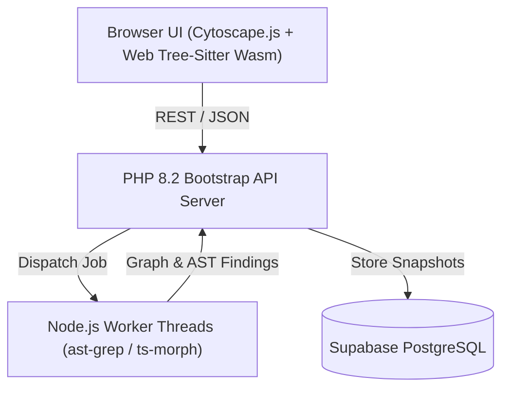

# WTFCode

Multi-engine static code analysis platform for exploring symbol graphs, AST dependencies, route maps, and security findings across large codebases.


## Overview

**WTFCode** is a web-based static analysis and code intelligence engine. It combines client-side WebAssembly parsing (via Web Tree-Sitter and ast-grep NAPI) with backend graph analysis (PHP 8.2 and Node.js worker threads) to provide interactive symbol graphs, route mapping, dependency tracking, and security auditing for multi-language repositories.

## Key Features

* **Interactive Symbol & Dependency Graphing**: Uses Cytoscape.js to render visual call graphs, imports, and symbol relationship hierarchies.
* **Multi-Engine Parsing**: Combines Web Tree-Sitter Wasm parsers with ast-grep structural patterns for instant AST traversal.
* **Framework & Route Extraction**: Automatically detects routes, controllers, and middleware across Laravel, Symfony, Express, and Next.js projects.
* **Security & Finding Auditing**: Runs AST-based security scanners to flag unsafe queries, unvalidated inputs, and secret leaks.
* **Supabase Integration**: Persists scan snapshots, project metadata, and audit artifacts into Supabase PostgreSQL.

## Tech Stack

**Frontend & Parsing Engine**
* JavaScript (ES6 Modules), Cytoscape.js
* Web Tree-Sitter (Wasm), `@ast-grep/napi`
* `ts-morph` AST engine

**Backend API & Workers**
* PHP 8.2 (Modular bootstrap router)
* Node.js Worker Threads (`workers/typescript-semantic.mjs`, `workers/tree-sitter.mjs`)
* Composer, Node.js

**Database & Deployment**
* Supabase PostgreSQL
* Docker, Vercel (`Dockerfile.vercel`)

## Architecture



## Getting Started

### Prerequisites
* PHP 8.2+
* Node.js 18+
* Composer & npm

### Installation

1. Clone the repository:
   ```bash
   git clone https://github.com/flegardev/WTFCode.git
   cd WTFCode
   ```

2. Install Node dependencies:
   ```bash
   npm install
   ```

3. Install PHP dependencies:
   ```bash
   composer install
   ```

4. Configure environment variables:
   ```bash
   cp .env.example .env
   ```

5. Start the PHP development server:
   ```bash
   php -S localhost:8000 -t public
   ```

## Environment Variables

```env
SUPABASE_URL=your_supabase_project_url
SUPABASE_SERVICE_ROLE_KEY=your_supabase_service_role_key
GITHUB_APP_CLIENT_ID=your_github_app_client_id
GITHUB_APP_CLIENT_SECRET=your_github_app_client_secret
```

## Development & Verification

```bash
# Validate Node worker threads and syntax
npm run check:workers
```

## License

This project is licensed under the MIT License.
